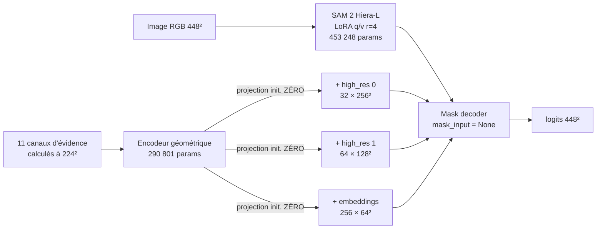

# CrackSAM-GeoLoRA — adaptation LoRA de SAM 2 guidée par la géométrie

**Quatrième itération de la ligne CrackSAM.** Première où la géométrie de Frangi
est *apprise dans* le modèle plutôt qu'appliquée en correction après coup.

<div align="center">

| Exécution | Matériel | Corpus | Variantes | Code |
|:--:|:--:|:--:|:--:|:--:|
| 8–9 août 2026 | RTX PRO 6000 Blackwell · 97,9 Go | Khánh Hà · 9 121 / 1 695 | 6 | [`geolora/`](geolora/) · 15 tests |

</div>

> [!IMPORTANT]
> **Deux résultats, à ne pas confondre.**
>
> ✅ **Les pertes rapportent.** Une perte **tolérante** à 3 px bat la baseline
> de `+0,0035` en IoU stricte — sur la métrique même qu'elle ne cherche pas à
> optimiser. `soft-clDice` gagne `+0,0263` dès qu'on mesure à 3 px de tolérance.
>
> ❌ **La géométrie ne rapporte rien, et c'est désormais prouvé causalement.**
> `geo_tol3` et son contrôle à évidence **permutée** sont indiscernables à toutes
> les tolérances — le contrôle étant même devant sur 5 des 6. Le modèle est
> indifférent au fait que la géométrie corresponde ou non à l'image qu'il regarde.

---

## Sommaire

1. [Résultats](#1-résultats)
2. [Le contrôle qui tranche](#2-le-contrôle-qui-tranche)
3. [Pourquoi mesurer avec tolérance](#3-pourquoi-mesurer-avec-tolérance)
4. [Conception](#4-conception)
5. [Galeries illustrées](#5-galeries-illustrées)
6. [Limites](#6-limites)
7. [Incidents et erreurs de raisonnement](#7-incidents-et-erreurs-de-raisonnement)
8. [Suite](#8-suite)

---

## 1. Résultats

<div align="center">


</div>

Six variantes, toutes affinées **5 époques à budget strictement égal** depuis la
LoRA archivée convergée, évaluées sur les 1 695 images du test officiel.

### 1.1 IoU tampon — la métrique à privilégier

Un pixel prédit compte s'il tombe à moins de `k` de la vérité ; un pixel vrai est
couvert s'il a une prédiction à moins de `k`. **Gras** = meilleur de la ligne.

| `k` | `baseline` | `cldice` | `geo` | `tol3` | `geo_tol3` | `geo_tol3_permuted` |
|---:|---:|---:|---:|---:|---:|---:|
| **0** | 0,6241 | 0,6066 | 0,6083 | **0,6276** | 0,6270 | 0,6265 |
| 1 | 0,7407 | 0,7574 | 0,7593 | 0,7586 | 0,7597 | **0,7601** |
| 2 | 0,7971 | 0,8213 | **0,8231** | 0,8186 | 0,8206 | 0,8214 |
| **3** | 0,8396 | 0,8659 | **0,8674** | 0,8607 | 0,8635 | 0,8644 |
| 5 | 0,8901 | 0,9110 | **0,9119** | 0,9072 | 0,9101 | 0,9108 |
| 8 | 0,9213 | 0,9341 | 0,9347 | 0,9346 | 0,9374 | **0,9378** |

<div align="center">


</div>

Trois lectures se superposent et il faut les séparer.

> [!TIP]
> **À tolérance nulle, `tol3` gagne.** `0,6276` contre `0,6241` pour la
> baseline, soit `+0,0035`. Cesser de pénaliser une erreur de frontière que
> l'annotation ne définit pas à mieux qu'un pixel **libère de la capacité utile**
> — le modèle est meilleur y compris sur la métrique stricte.

> [!NOTE]
> **Dès 1 px de tolérance, la famille `clDice` prend la tête.** Les courbes se
> croisent entre `k=0` et `k=1`. Le verdict « aucune variante ne bat la
> baseline » ne tenait qu'à tolérance nulle. À `k=3`, `geo` atteint `0,8674`
> contre `0,8396`, soit **`+0,0278`**.

> [!WARNING]
> **Aucune des colonnes géométriques ne se distingue de son contrôle.**
> `geo_tol3` et `geo_tol3_permuted` diffèrent de moins de `0,001` partout, et le
> **contrôle est devant sur 5 tolérances sur 6**.

### 1.2 Métriques strictes complémentaires

| Variante | IoU | Précision | Rappel | Couv. squelette | Composantes | Sans évidence |
|:---|---:|---:|---:|---:|---:|---:|
| `baseline` | 0,6241 | 0,7588 | 0,7607 | 0,6792 | 2,76 | — |
| `cldice` | 0,6066 | 0,6738 | 0,8567 | **0,8254** | 2,65 | — |
| `geo` | 0,6083 | 0,6742 | **0,8590** | **0,8263** | 2,52 | 0,6138 |
| **`tol3`** | **0,6276** | 0,7400 | 0,7940 | 0,7238 | 3,31 | — |
| `geo_tol3` | 0,6270 | 0,7432 | 0,7869 | 0,7162 | 5,97 | 0,6281 |
| `geo_tol3_permuted` | 0,6265 | 0,7383 | 0,7925 | 0,7232 | 5,66 | 0,6281 |

<details>
<summary><b>IoU des masques dilatés — convention EUVIP du dépôt</b></summary>

<br>

`IoU(dilate(P,k), dilate(G,k))`, la convention de `thicken(sk, 6)` puis Jaccard
employée dans le code EUVIP. Elle épaissit les deux masques, donc elle favorise
les prédictions déjà larges — d'où la domination franche de la famille `clDice`,
qui sur-prédit.

| `k` | `baseline` | `cldice` | `geo` | `tol3` | `geo_tol3` | `geo_tol3_permuted` |
|---:|---:|---:|---:|---:|---:|---:|
| 0 | 0,6241 | 0,6066 | 0,6083 | **0,6276** | 0,6270 | 0,6265 |
| 1 | 0,6633 | 0,7028 | **0,7040** | 0,6846 | 0,6841 | 0,6856 |
| 2 | 0,6880 | 0,7327 | **0,7338** | 0,7112 | 0,7115 | 0,7131 |
| 3 | 0,7095 | 0,7558 | **0,7568** | 0,7334 | 0,7342 | 0,7357 |
| 5 | 0,7417 | 0,7883 | **0,7892** | 0,7653 | 0,7664 | 0,7680 |
| 8 | 0,7720 | 0,8175 | **0,8181** | 0,7943 | 0,7960 | 0,7974 |

C'est précisément parce que les deux conventions ne classent pas pareil qu'il
faut choisir la sienne **avant** de mesurer, et le dire.

</details>

---

## 2. Le contrôle qui tranche

Le rapport précédent devait déclarer comme limite l'absence de contrôle causal.
Il a été exécuté cette fois. Le triplet est apparié : même perte tolérante `k=3`,
même budget, même graine.

| Variante | Perte | Évidence | Paramètres |
|:---|:---|:---|---:|
| `tol3` | tolérante `k=3` | aucune | 453 248 |
| `geo_tol3` | tolérante `k=3` | **alignée** | 744 049 |
| `geo_tol3_permuted` | tolérante `k=3` | **celle d'une autre image** | 744 049 |

### Écarts face au contrôle, à toutes les tolérances

| `k` | `geo_tol3` | `geo_tol3_permuted` | Δ (aligné − permuté) |
|---:|---:|---:|---:|
| 0 | 0,6270 | 0,6265 | `+0,0005` |
| 1 | 0,7597 | 0,7601 | `−0,0004` |
| 2 | 0,8206 | 0,8214 | `−0,0008` |
| 3 | 0,8635 | 0,8644 | `−0,0009` |
| 5 | 0,9101 | 0,9108 | `−0,0007` |
| 8 | 0,9374 | 0,9378 | `−0,0004` |

> [!CAUTION]
> **Aligner la géométrie sur l'image ne sert à rien.** Sur six tolérances,
> l'évidence permutée fait aussi bien ou mieux cinq fois. L'adapter s'active
> pourtant — ses projections croissent jusqu'à `1,79 × 10⁻³` — mais ce qu'il
> apprend ne dépend pas de la correspondance entre l'évidence et l'image.

Le déficit résiduel de `geo_tol3` face à `tol3` (`−0,0006` à `k=0`) s'explique
donc par les **290 801 paramètres ajoutés**, qui coûtent un peu sans rien
rapporter — et non par un mauvais usage de la géométrie.

<div align="center">


</div>

Le nuage est **sur la diagonale**. Moyenne des deltas appariés : `−0,0007`, pour
603 gains, 866 pertes et 226 nuls. L'histogramme central est un pic étroit
centré sur zéro : ajouter la géométrie ne change presque rien, image par image.

À comparer avec la même vue pour la perte tolérante, où la structure est
visible :

<div align="center">


</div>

---

## 3. Pourquoi mesurer avec tolérance

### 3.1 La vérité terrain ne se ressemble pas à elle-même

| Perturbation du GT | IoU contre l'original |
|:---|---:|
| dilaté de 1 px | 0,881 |
| érodé de 1 px | 0,843 |
| dilaté de 2 px | 0,799 |

Un décalage d'un pixel coûte **douze points d'IoU** — davantage que tous les
écarts entre variantes mesurés ici. Comparer deux méthodes à `±0,02` d'IoU
stricte revient largement à comparer leur biais de largeur.

La confirmation vient de la précision tolérante : pour la baseline, elle passe de
`0,759` à `0,888` entre `k=0` et `k=1`, quand le rappel ne bouge que de `0,761` à
`0,812`. **L'essentiel de ce que l'IoU stricte compte comme faux positifs se
situe à moins d'un pixel de la vérité.** Ce n'est pas de la fausse détection,
c'est du débordement de frontière.

### 3.2 La tolérance pardonne le placement, jamais la topologie

Validation sur cas synthétiques de la métrique (`iou_buffered`) :

| Cas | `k=0` | `k=1` | `k=2` | `k=5` |
|:---|---:|---:|---:|---:|
| prédiction parfaite | 1,000 | 1,000 | 1,000 | 1,000 |
| décalée de 2 px | 0,200 | 0,500 | **1,000** | 1,000 |
| deux fois trop large | 0,429 | 0,714 | **1,000** | 1,000 |
| **rompue en son milieu** | 0,875 | 0,887 | 0,900 | **0,938** |

Et de la perte différentiable correspondante (`1 − F1` tolérant) :

| Cas | `k=0` | `k=1` | `k=3` | `k=5` |
|:---|---:|---:|---:|---:|
| parfait | 0,0000 | 0,0000 | 0,0000 | 0,0000 |
| décalé de 2 px | 0,4988 | 0,2494 | **0,0000** | 0,0000 |
| rompu | 0,1018 | 0,0907 | **0,0691** | 0,0484 |

Une rupture reste pénalisée à toutes les tolérances. C'est ce qui rend la mesure
utilisable pour juger de la continuité, et la perte utilisable pour l'apprendre.

### 3.3 La perte tolérante

```python
G_k = soft_dilate(G, k)          # max-pooling, différentiable
P_k = soft_dilate(P, k)
precision = Σ(P · G_k) / ΣP      # un pixel prédit à moins de k compte
recall    = Σ(G · P_k) / ΣG      # un pixel vrai couvert à moins de k compte
L_tol     = 1 − 2·precision·recall / (precision + recall)
```

Implémentée dans [`geolora/losses.py`](geolora/losses.py), sur la même machinerie
morphologique que `soft_skeleton`. Les variantes `tol*` n'incluent
volontairement **pas** `clDice`, afin d'isoler l'effet de la tolérance seule.

---

## 4. Conception

### 4.1 Ce que les trois échecs précédents imposent

| Échec mesuré | Correction appliquée ici |
|:---|:---|
| Pseudo-masque dense, `−0,0979` d'IoU en causal | la géométrie **n'entre jamais** par `mask_input` |
| Moyenne géométrique équivariante sous perturbation | les 11 canaux restent **séparés** jusqu'à l'encodeur |
| Corridors couvrant 1,8 % contre 5,7 % de GT | injection **multi-échelle** |
| Échelles héritées d'une étude « fissures fines » | filtres **réaccordés** sur les `19,1 px` mesurés |

### 4.2 Architecture



À l'initialisation les projections sont nulles : le modèle **est** exactement la
baseline gelée, et `evidence=None` restitue cette voie au bit près.

<details>
<summary><b>Échelles des filtres, dérivées de la mesure et non héritées</b></summary>

<br>

Une fissure Khánh Hà fait `19,1 px` de large à 448, donc `9,6 px` à la
résolution de calcul de 224.

| Filtre | Paramètre | Valeur |
|:---|:---|:---|
| Frangi historique | `σ` | `{1,5 ; 3 ; 5 ; 8 ; 12}` |
| Oriented Flux Symmetry | rayons | `{2, 3, 4, 6, 8}` |
| Symétrie de phase | longueurs d'onde | `{5, 8, 12, 18}` |
| Profil / paire-impair / ΔBIC | `σ` | `{1,2 ; 2 ; 3 ; 4,5 ; 6}` |

</details>

---

## 5. Galeries illustrées

Code couleur des panneaux : **🟩 vert** = vrai positif · **🟥 rouge** = faux
positif · **🟦 bleu** = manqué. La ligne du bas montre quatre des onze canaux
d'évidence.

### 5.1 Ce que la perte tolérante change — `baseline` → `tol3`


**`cracktree200_6774` · baseline `0,000` → `tol3`.** La baseline manque
**intégralement** le réseau : tout est bleu. La perte tolérante permet au modèle
de le retrouver.


Les gains se concentrent sur `cracktree200`, où les fissures sont **fines et peu
contrastées** — exactement le régime où exiger une frontière au pixel près est le
plus coûteux et le moins pertinent.


**`GAPS384_0552`.** La contrepartie : sur une fissure mince le long d'un bord
clair, la tolérance autorise un débordement que l'IoU stricte sanctionne.

### 5.2 Ce que la géométrie change — `tol3` → `geo_tol3`


**`Rissbilder_for_Florian` · `0,153` → `0,405`, soit `+0,252`.** Le plus grand
gain de la paire. Mais regardez les canaux : `frangi_sim` est une tache informe
sur le bord supérieur, `ofa` sature de coulures verticales, `phase_sym` n'est
qu'un entrelacs d'artefacts. **Aucun ne désigne la fissure.**

> [!WARNING]
> Ce panneau illustre le piège de la galerie sélective. Ce gain est réel, mais
> le contrôle permuté obtient la **même performance moyenne** : il s'agit de
> variance d'entraînement, pas d'un effet de la géométrie. C'est exactement
> pourquoi une figure ne remplace pas un contrôle.


Les pertes sont symétriques des gains, en nombre comme en amplitude — 603 gains
contre 866 pertes, pour une moyenne de `−0,0007`.

<details>
<summary><b>Six panneaux supplémentaires</b></summary>

<br>

**`baseline` → `tol3`** ·
[réussite `cracktree200_6281`](figures/generated/case_baseline_vs_tol3_reussite_03_cracktree200_6281.jpg) ·
[échec `CRACK500_20160405_171336`](figures/generated/case_baseline_vs_tol3_echec_00_CRACK500_20160405_171336_641_361.jpg) ·
[échec `Rissbilder`](figures/generated/case_baseline_vs_tol3_echec_01_Rissbilder_for_Florian_9S6A2817_67_221_2558_2411.jpg)

**`tol3` → `geo_tol3`** ·
[réussite `CRACK500_20160405_172908`](figures/generated/case_tol3_vs_geo_tol3_reussite_03_CRACK500_20160405_172908_1281_1.jpg) ·
[réussite `CRACK500_20160405_171336`](figures/generated/case_tol3_vs_geo_tol3_reussite_05_CRACK500_20160405_171336_641_361.jpg) ·
[échec `GAPS384_1347`](figures/generated/case_tol3_vs_geo_tol3_echec_01_GAPS384_train_1347_541_1.jpg)

**`baseline` → `geo` (clDice)** ·
[réussites et échecs](figures/generated/) sous `case_reussite_*` et `case_echec_*`

</details>

### 5.3 Une observation que les moyennes cachaient

> [!IMPORTANT]
> **La largeur de `19,1 px` est une moyenne trompeuse.** Les scènes
> `cracktree200`, `GAPS384` et `Rissbilder` montrent des vérités terrain à
> `0,4–0,8 %` de pixels, c'est-à-dire des fissures **fines**, alors que la
> moyenne est dominée par les sous-ensembles à annotations épaisses. En
> réaccordant les filtres sur `19,1 px`, j'ai sur-corrigé pour une partie du
> corpus — visible directement dans les taches informes de `frangi_sim`.

Une évidence **multi-échelle**, plutôt qu'accordée à une largeur unique, reste
la piste la plus concrète — même si le contrôle permuté suggère que le problème
n'est pas seulement d'échelle.

---

## 6. Limites

- [x] ~~Contrôle causal manquant~~ — **exécuté** : `geo_tol3_permuted`.
- [ ] **`geo_permuted` et `geo_noise`** (famille `clDice`) n'ont pas été
      entraînés. Le `+0,0015` de `geo` sur `cldice` n'est donc pas
      causalement attribué, mais le contrôle du triplet `tol3` rend une
      conclusion différente très improbable.
- [ ] **`tol5` non exécuté** — sacrifié pour faire place au contrôle causal, qui
      importait davantage. La sensibilité au rayon reste inconnue.
- [ ] **5 époques, pas 20.** Les variantes repartent d'un modèle convergé, mais
      l'optimum de validation de la baseline archivée est à l'époque 20.
- [ ] **Pas d'IC95 sur les écarts entre variantes.** Les deltas appariés sont
      calculés, le bootstrap groupé ne l'est pas — plusieurs écarts sont du même
      ordre que la variance d'entraînement.
- [ ] **Évidence mono-échelle** accordée à une largeur moyenne peu
      représentative (§5.3).
- [ ] Aucune évaluation multimodale, ni sur ombres naturelles.

---

## 7. Incidents et erreurs de raisonnement

<details>
<summary><b>Quatre incidents d'exécution</b></summary>

<br>

**Un point selle d'initialisation.** Les projections finales *et* le gain global
étaient tous deux initialisés à zéro. La sortie valant `gamma × projection(x)`,
les deux gradients s'annulent : l'adapter reste figé. Constaté en réel —
`activation = 0,0000` après une époque complète, et la variante géométrique
numériquement identique à sa version sans géométrie. Corrigé (`gamma = 1`,
projections nulles), avec le test de régression
`test_adapter_gradients_are_not_both_dead_at_initialisation`.

**Un correctif qui n'a jamais atteint la machine.** L'archive le contenant a été
transférée, mais son extraction se trouvait dans une session SSH qui a échoué.
Une heure de GPU consommée à réentraîner le code figé.

**Deux entraînements concurrents sur le même GPU.** Un processus rescapé d'un
lancement antérieur partageait le GPU, doublant la durée des époques.

**Le pilote NVIDIA cassé au redémarrage.** Le noyau était passé de
`6.8.0-1063-gcp` à `1065` sans reconstruction des modules. Réparé par
installation additive du paquet versionné, sans purge.

</details>

<details>
<summary><b>Trois conclusions fausses que les mesures ont corrigées</b></summary>

<br>

**« L'adapter coûte 2,5× plus cher. »** Faux : c'était la contention GPU entre
deux entraînements concurrents. Mesuré proprement, `geo_tol3` prend 41 minutes
contre 40 pour `tol3` — l'adapter ne coûte presque rien. L'écart initialement
observé avec `geo` (61 min) venait de `soft-clDice`, dont la squelettisation
douce coûte dix passes de pooling par échantillon.

**« `soft-clDice` dégrade. »** Faux sous une métrique adaptée : elle coûte
`−0,0175` en IoU stricte et rapporte `+0,0263` à `k=3`. Ce que l'IoU stricte
comptait comme faux positifs était du débordement de frontière.

**« Aucune variante ne bat la baseline. »** Vrai à tolérance nulle uniquement.
`tol3` la bat même en strict (`+0,0035`), et toute la famille tolérante la
dépasse dès `k=1`.

Le fil commun : **trois fois, une conclusion tirée trop tôt d'une mesure
inadaptée.** Le seul garde-fou qui a fonctionné est celui qui consiste à
mesurer autrement et à exécuter le contrôle.

</details>

---

## 8. Suite

| Priorité | Action | Justification |
|:--:|:---|:---|
| **1** | **Adopter la perte tolérante comme défaut.** `tol3` bat la baseline en strict *et* en tolérant, pour un coût nul. | gain acquis, reproductible |
| **2** | **Trancher la métrique du projet.** `clDice` domine à `k ≥ 1` et en convention EUVIP ; `tol3` domine en strict. Le choix conditionne tout classement futur. | les deux conventions ne classent pas pareil |
| 3 | **Porter l'expérience en multimodal sur FIND.** SAM 2 n'a pas accès à la portée ; c'est le seul cadre où l'argument géométrique repose sur de l'information. | thèse de l'article ISPRS |
| 4 | Compléter les IC95 par bootstrap groupé, et `geo_permuted` pour la famille `clDice`. | plusieurs écarts sont dans le bruit |

> [!CAUTION]
> **Ce qu'il ne faut pas faire :** augmenter la capacité de l'adapter, allonger
> l'entraînement, ou empiler un GNN. Le contrôle permuté montre que le modèle est
> **indifférent à l'alignement de la géométrie**. Ce n'est pas un signal faible
> mal exploité, c'est l'absence de signal.

Sur Khánh Hà — monomodal visible, annotations épaisses, baseline supervisée sur
ce domaine même — le Frangi généralisé n'apporte aucune information que la LoRA
n'ait déjà apprise. Après quatre itérations et un contrôle causal propre, c'est
la conclusion la plus solide de cette ligne de travail.

---

## Reproduire

```bash
python -m pytest ISPRS/CrackSAM-GeoLoRA/tests -q       # 15 tests

G=ISPRS/CrackSAM-GeoLoRA
L=ISPRS/CrackSAM/protocol/cracksam_paper/lists/lists_khanhha
C=ISPRS/CrackSAM/artifacts/vm_backup_20260714T1435Z_final_checkpoints

# 1. cache d'évidence — obligatoire, ~19 s/image, pour train ET val
python $G/scripts/01_cache_evidence.py --data-root $DATA/khanhha --split train \
  --list-file $L/train.txt --output $RUN/evidence --jobs 40
python $G/scripts/01_cache_evidence.py --data-root $DATA/khanhha --split train \
  --list-file $L/val_vol.txt --output $RUN/evidence --jobs 40

# 2. une variante : baseline | cldice | geo | tol3 | tol5 | geo_tol3 | geo_tol3_permuted
python $G/scripts/02_train.py --variant geo_tol3 --init-from-baseline \
  --data-root $DATA/khanhha --train-list $L/train.txt --val-list $L/val_vol.txt \
  --evidence-root $RUN/evidence --sam2-checkpoint $C/foundation/sam2_hiera_large.pt \
  --sam2-lora $C/baseline_r4/best.pt --output $RUN/ckpt --epochs 5 --batch-size 8

# 3. évaluation + test de nécessité d'entrée
python $G/scripts/03_evaluate.py --checkpoint $RUN/ckpt/geo_tol3_best.pt \
  --data-root $DATA/khanhha --list-file $L/test_vol.txt \
  --evidence-root $RUN/evidence --sam2-checkpoint $C/foundation/sam2_hiera_large.pt \
  --output $RUN/eval --save-masks $RUN/eval/masks_geo_tol3

# 4. IoU tolérante, toutes variantes
python $G/scripts/05_tolerant_iou.py --masks $RUN/eval/masks_* \
  --names baseline cldice geo tol3 geo_tol3 geo_tol3_permuted \
  --data-root $DATA/khanhha --output $RUN/tolerance

# 5. figures, paire au choix
python $G/scripts/04_figures.py --run-root $RUN --data-root $DATA/khanhha \
  --output $RUN/figures --pair tol3 geo_tol3
```

Chaque époque écrit un `*_latest.pt` complet, état de l'optimiseur compris : la
reprise après préemption Spot repart à l'époque suivante.

<details>
<summary><b>Artefacts</b></summary>

<br>

| Fichier | Contenu |
|:---|:---|
| [`tolerant_summary.json`](tables/generated/tolerant_summary.json) | **le tableau complet à six variantes et six tolérances** |
| [`eval_*.json`](tables/generated/) | métriques strictes par variante, avec test de nécessité d'entrée |
| [`*_training.json`](tables/generated/) | historiques par époque, activation de l'adapter comprise |
| [`tolerant_*.csv`](tables/generated/) | scores tolérants par image |
| [`per_image_*.csv`](tables/generated/) | IoU, Dice, composantes, couverture par image |
| [`manifest_train.json`](tables/generated/manifest_train.json) | échelles des filtres, gelées |

</details>

---

## Références internes

- [Présentation Inria–Cerema du 9 août 2026](presentations/2026-08-09-cracksam-geolora/)
  — 10 planches : le résultat négatif de la géométrie, le gain de la dilatation
- [CrackSAM-GFA — arbitrage de fragments](../CrackSAM-GFA/RAPPORT.md)
- [Étude filtre-seul anti-ombre](../CrackSAM/results/2026-08-08_guidage_geometrique_anti_ombre/RAPPORT.md)
- [Question expérimentale et vocabulaire](../CrackSAM/docs/01_EXPERIMENTAL_QUESTION.md)
- [Papier EUVIP — Generalized Frangi](../../EUVIP/EUVIP_2026_Generalized_Frangi_Multimodality_camera-ready.pdf)
